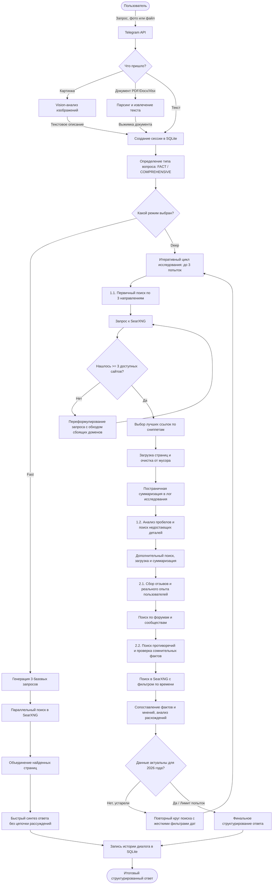

# SearchXNG Telegram Bot

Бот для глубокого поиска информации в интернете в реальном времени. Работает через связку поискового движка SearXNG и LLM (поддерживает любые OpenAI-совместимые API: от локального Ollama до OpenRouter, OpenAI, DeepInfra и других).

С ним можно общаться как в обычном чате, так и напрямую из любого диалога через **инлайн-режим (inline mode)**.

---

## Что умеет бот

* **Сбор и проверка фактов**. Бот выгружает данные из нескольких независимых источников, сравнивает их между собой и отсеивает дезинформацию. Пользователю выдается готовый структурированный ответ без ссылок на источники.
* **Привязка к текущему времени (2026 год)**. Бот учитывает даты публикаций, умеет определять актуальные версии программного обеспечения и моделей устройств, опираясь на контекст текущего года.
* **Компактные ответы в инлайн-режиме**. При вызове через `@имя_бота` ответ форматируется в виде пары коротких абзацев со списком общим объемом около 100 слов. Такое сообщение удобно читать прямо в групповом чате.
* **Использование внутренних ресурсов**. Бот не выводит списки веб-страниц или ссылок в чат, фокусируясь исключительно на передаче сути ответа.

---

## Как это устроено внутри

### Жизненный цикл запроса



---

## Режимы работы

### 1. Быстрый поиск (Fast Mode)
Подходит для простых вопросов, где нужен быстрый ответ (команда, дата, короткий факт). 
* Бот классифицирует запрос как `FACT`, расширяет лимит проверяемых сайтов до 10, делает один параллельный запрос и сразу формулирует ответ.
* Логика рассуждений (тег `<think>`) здесь отключена. Время генерации ответа составляет **около минуты** (зависит от скорости модели и качества API-провайдера).

### 2. Глубокое исследование (Deep Mode)
Для тем, где нет однозначного ответа или нужно сравнить несколько точек зрения.
* Время полного исследования и генерации финального ответа составляет **от 5 до 15 минут** (в зависимости от скорости генерации токенов моделью и стабильности провайдера).
* **Многоэтапный сбор**: Бот ищет основную информацию, затем анализирует получившийся лог, находит пробелы и запускает второй круг поиска.
* **Сбор мнений**: Отдельно ищет отзывы, темы на Reddit, GitHub Issues и форумах, чтобы найти практические нюансы использования.
* **Перекрестная проверка**: Сравнивает официальные данные с отзывами пользователей и отчетами об ошибках.
* **Оценка актуальности информации**: Бот оценивает свежесть найденных данных в контексте текущего года. При обнаружении устаревшей информации запускается дополнительный цикл поиска с более жесткими фильтрами дат.
* **Автоматический обход блокировок**: Если сайт не открывается или выдает ошибку (например, блокировка Cloudflare), бот анализирует причину сбоя, переформулирует запрос и ищет альтернативные источники.
* **Резервный каскад моделей**: Если основной сервер LLM перегружен или недоступен, бот не упадет с ошибкой, а автоматически переключится на резервные модели из списка настроек.

---

## Настройка и запуск

### Требования
* Python 3.11+
* Развернутый инстанс SearXNG
* Доступ к любому OpenAI-совместимому API (локальный Ollama, OpenRouter, OpenAI и т.д.)

### 1. Конфигурация
Скопируйте шаблон настроек окружения:
```bash
cp .env.example .env
```
Откройте `.env` и заполните параметры:
* `TELEGRAM_BOT_TOKEN` — токен от @BotFather.
* `OLLAMA_BASE_URL` — адрес API (например, `http://localhost:11434/v1` для Ollama или `https://openrouter.ai/api/v1` для OpenRouter).
* `OLLAMA_API_KEY` — ключ авторизации (для локальной Ollama можно оставить пустым).
* `OLLAMA_MODEL` — название используемой модели.
* `SEARXNG_URL` — ссылка на ваш поисковик SearXNG.

### 2. Запуск через Docker
Проект полностью готов к запуску в контейнерах:
```bash
docker compose -f docker-compose.sum.yml up -d --build
```

---

## Архитектура проекта

* `bot.py` — основной файл с классическим RAG-алгоритмом.
* `searchxng_sum.py` — ядро глубокого поиска, логика агента, парсинг страниц и суммаризация.
* `bot_remote.py` / `tg_super_final.py` — вспомогательные модули управления.
* `requirements.txt` — зависимости проекта.
* `config.db` — база данных SQLite для сохранения сессий пользователей и истории диалогов.

---

## Лицензия

Проект распространяется под лицензией MIT. Можно использовать и дорабатывать под свои задачи.
